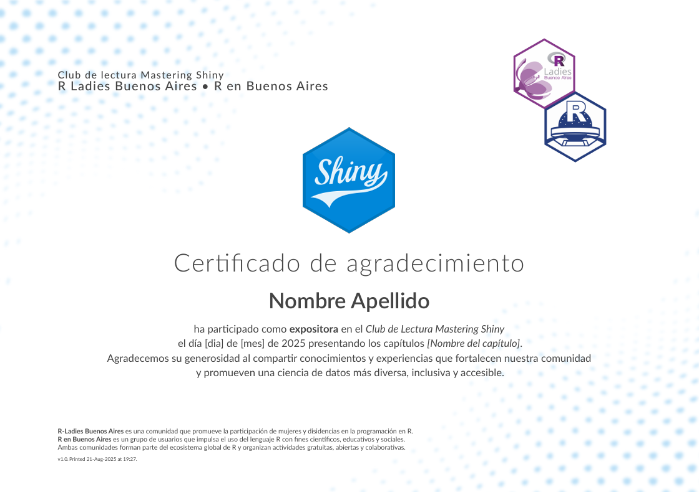

# Certificado de Agradecimiento - [Club de Lectura Mastering Shiny](https://github.com/renbaires/mastering-shiny) 

Este repositorio contiene una plantilla en **Quarto + Typst** para generar certificados de agradecimiento a las expositoras del **Club de Lectura Mastering Shiny**, organizado por **R-Ladies Buenos Aires** y **R en Buenos Aires**.

El diseño incluye:\
- Logos de las comunidades organizadoras y del ecosistema R.\
- Personalización automática de nombre, fecha y capítulo presentado.\
- Formato PDF de alta calidad, listo para imprimir o compartir digitalmente.




------------------------------------------------------------------------

## 🚀 Cómo usar

1.  Instalar [Quarto](https://quarto.org/) y asegurarse de tener Typst habilitado.

``` bash

quarto check typst
```

2.  Clonar este repositorio:

``` bash

git clone https://github.com/ariilbard/quarto-typst-certificate-mastering-shiny-bookclub.git
cd quarto-typst-certificate-mastering-shiny-bookclub
```

3.  Editar el archivo `index.qmd` modificando los siguientes campos:

-   Nombre y Apellido

-   Fecha del evento

-   Capítulo presentado

4.  Renderizar el certificado:

``` bash

quarto render index.qmd

```

✨ Créditos

Plantilla original: [quarto-typst-certificate](https://github.com/royfrancis/quarto-typst-certificate)

Elaborado por: Ariana Bardauil

