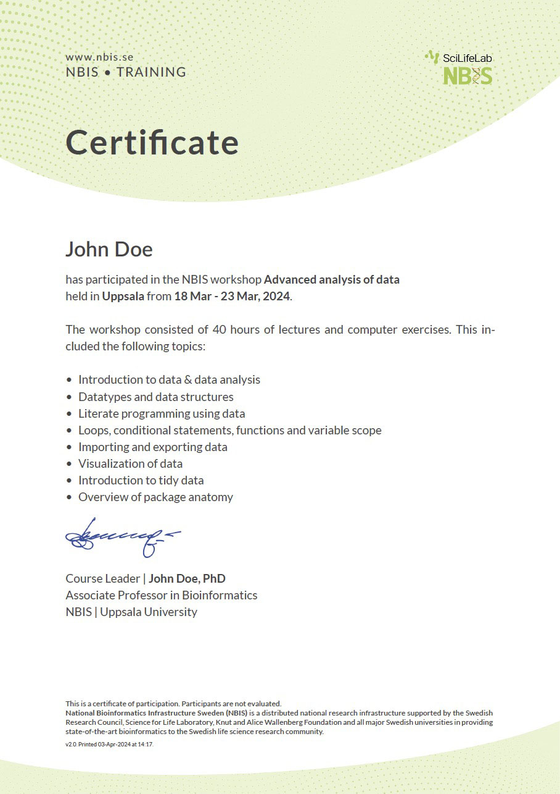

# quarto-typst-certificate

A quarto extension that uses typst to create a PDF certificate



## Installation

:warning: Requires quarto 1.4.

```
quarto use template royfrancis/quarto-typst-certificate
```

## Render

```
quarto render index.qmd
```

To modify parameters;

```
quarto render index.qmd --metadata participant:"Sanna Jonsson"
```

---

2024 • Roy Francis
